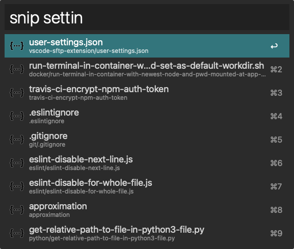

# Local Snippets

Paste the contents of a file picked from a directory. Fuzzy search finds the right file by filename. Therefore, the [FZF][1] program must be installed in the system. To install FZF, run `brew install fzf`.

`PATH_TO_FZF` - The path to the fzf program. For example, `/usr/local/bin/fzf`. Run `which fzf` in the terminal to find it.

`SNIPPETS_DIRECTORY` - The absolute path to the directory containing the snippets. If the files in the directory are in popular file formats, it's possible to preview them by pressing `Shift` directly in Alfred.

[1]: https://github.com/junegunn/fzf
